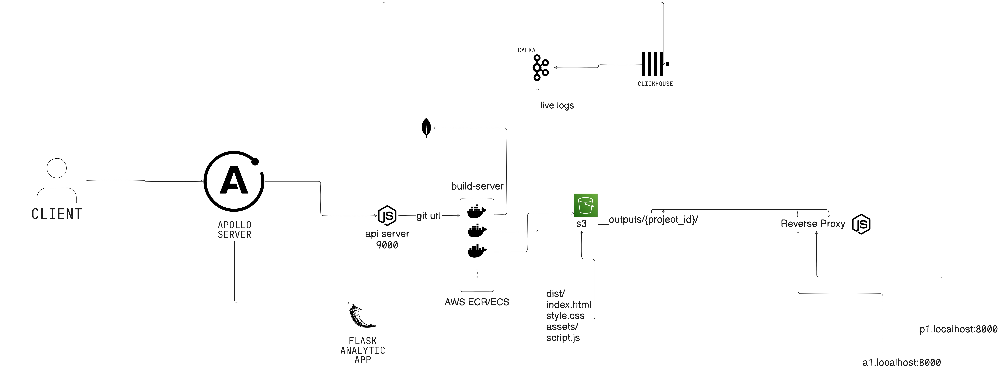

# Neploy

Neploy is a web application that simplifies the deployment of React apps on the web. Users can create accounts, add projects using GitHub links, initiate deployments, manage project details, view live deployment logs, access website analytics (e.g., daily visitor count displayed as a line graph), manage user profiles, change avatars, delete projects, delete users, and more.

## Technologies Used

- Next.js
- Tailwind CSS
- Shadcn
- Aceternity
- Framer Motion
- Node.js
- Express.js
- GraphQL
- REST API
- Apollo Server
- MongoDB
- AWS ECS
- AWS EC2
- AWS ECR
- Kafka
- ClickHouse
- Redis
- Firebase (for authentication)

## How It Works

- User authentication is handled via Firebase.
- CRUD operations are performed using GraphQL, with requests sent to the Apollo Server backend.
- When a deployment is initiated, the GraphQL backend sends a request to another backend called the API Server (written in TypeScript). This API Server spins up an AWS ECS container using a task definition. The container, containing Node.js code, fetches the code from GitHub, runs `npm run build`, and uploads the resulting code to an S3 bucket.
- When users visit their deployed project URL, a request is sent to another backend server, which uses a reverse proxy to serve all static files.

## Architecture Diagram

## Project Structure

1. `backend-1-apollo-server-graphql`
2. `backend-2-api-server-typescript`
3. `backend-3-reverse-proxy-server`
4. `build-server-docker-container`
5. `get-analytics-backend-flask`
6. `nextjs-frontend`

## Resources

- [Behind the Scenes of Vercel's Infrastructure](https://vercel.com/blog/behind-the-scenes-of-vercels-infrastructure)
- [YouTube: Piyush Garg](https://www.youtube.com/watch?v=0A_JpLYG7hM)

## Visit Neploy

You can visit Neploy at [neploy.netlify.app](https://neploy.netlify.app/).

## Note

Please note that the live logs feature may not work as expected because I used Aiven services (ClickHouse, Kafka) for it, but its free trial has ended.

## License

This project is licensed under the MIT License - see the [LICENSE](LICENSE) file for details.
